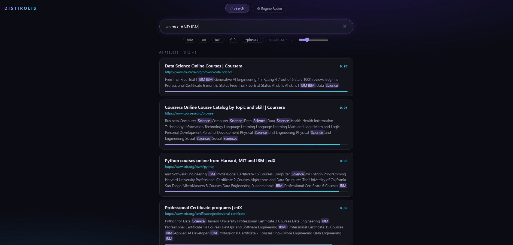
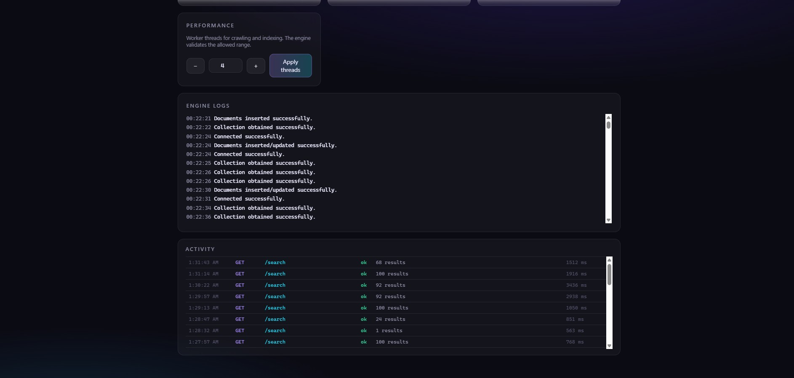

# Distirolis

A search engine built from scratch in C++. It crawls the real web, builds a positional inverted index, ranks with BM25, and answers boolean queries with highlighted snippets. A React control room drives the whole engine live in the browser.



## What I built

**A concurrent web crawler.** Worker threads pull from a shared frontier, fetch pages with libcurl, respect robots.txt, and stream results to MongoDB in small batches so an interrupted crawl loses almost nothing. It has crawled corpora of 10,000+ pages, and every run is resumable: visited URLs persist across sessions and already fetched pages are never refetched.

**A positional inverted index.** Documents are tokenized with a linear scanner I wrote after profiling showed regex tokenization could not survive real web content, then normalized and stemmed with Snowball. The index stores every term position per document, which is what makes exact phrase matching and snippet highlighting possible. Indexing runs on a thread pool: 7,000 documents become 112,000+ unique terms in about three minutes on four threads.

**BM25 ranking with a query language.** Queries support AND, OR, NOT, parentheses, and quoted exact phrases, evaluated with a shunting yard style operator engine over per document score maps. Phrase matches earn a configurable boost, term and exact match scores blend with tunable weights, and results come back sorted with a snippet centered on the best scoring window of query hits, each hit highlighted.

**An HTTP API.** A Crow server exposes the engine: search, crawl, index, terminate, ranker parameters, thread count, and a live log endpoint. Logs work through a custom streambuf that tees stdout and stderr into a thread safe in memory ring buffer, so the browser can stream exactly what the engine prints, including errors, with no file I/O.

**A full web UI.** React 19 with TypeScript, covered by 44 component tests. The Search realm gives instant queries with scores, highlighted snippets, and an accuracy slider. The Engine Room drives everything else: bulk seed loading from a text file, crawl and index controls with confirm guards on destructive actions, a BM25 parameter lab, thread configuration, live engine logs polled every two seconds, and a per session activity table of every API call with timing.




## Engineering I am proud of

The engine survives the real web. Getting there meant root causing genuine production class failures with gdb: a stack overflow inside std::regex on pathological pages, a segfault in thread local destructors during thread pool teardown, and data races on a shared MongoDB client across server threads. Each fix is in the history as its own commit with the reasoning in the message.

The system degrades instead of dying. Worker threads carry exception barriers so one poisoned page skips rather than kills the process. If the database becomes unreachable mid run, index builds abort cleanly, metadata is never overwritten with emptiness, and the ranker keeps serving its in memory snapshot. Crawls flush work continuously so a hard kill costs at most one small batch.

Correctness was verified end to end, not assumed: curl regression suites for query parsing and result ordering, concurrent load tests that previously crashed the server in seconds and now pass, and direct database audits after every recovery scenario.

## Stack

C++20, CMake, Crow, libcurl, libxml2, Snowball stemmer, MongoDB (mongoc), React 19, TypeScript, Vite, Vitest.

## Run it

Build the engine with CMake, then start it with your MongoDB connection string:

```
cmake -B build && cmake --build build
./build/DistributedSearchEngine "<mongodb connection string>" "proxy"
```

Start the UI and open http://localhost:5173 with the engine on port 8080:

```
cd frontend
npm install
npm run dev
```
